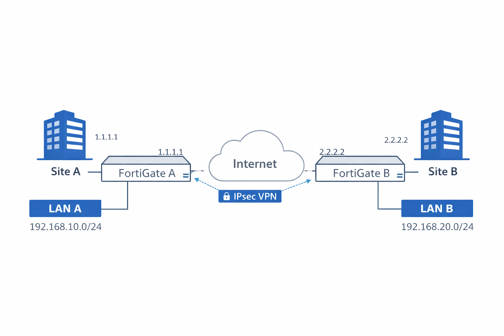

# Lab 03 – Site-to-Site IPsec VPN (FortiGate ↔ FortiGate)

## 📌 Overview
This lab demonstrates how to design, configure, and troubleshoot a
**Site-to-Site IPsec VPN** between two FortiGate firewalls.

The goal is to securely connect two remote sites over the internet
using enterprise-grade encryption and best practices.

---

## 🎯 Objectives
- Understand Site-to-Site IPsec VPN concepts
- Configure Phase 1 and Phase 2 correctly
- Establish secure connectivity between two LANs
- Apply firewall policies for VPN traffic
- Verify and troubleshoot the VPN tunnel

---

## 🧱 Lab Environment

### 🔧 Devices
- FortiGate – Site A
- FortiGate – Site B

### 🌐 Network Details

#### 🏢 Site A
- WAN IP: `1.1.1.1`
- LAN Subnet: `192.168.10.0/24`

#### 🏢 Site B
- WAN IP: `2.2.2.2`
- LAN Subnet: `192.168.20.0/24`

### 🌐 Topology

---

## 🧠 IPsec VPN Concepts (Quick Review)

- **Phase 1**: Tunnel establishment & peer authentication
- **Phase 2**: Traffic encryption parameters
- **IKEv2**: Recommended for stability and security
- **Selectors**: Define which subnets are encrypted

---

## ⚙️ Step 1 – Phase 1 Configuration (Site A)

- VPN Type: IPsec Tunnel
- Template: Site to Site
- IKE Version: IKEv2
- Remote Gateway: `2.2.2.2`
- Authentication Method: Pre-Shared Key
- Encryption: AES256
- Authentication: SHA256
- DH Group: 14
- Key Lifetime: 28800

📌 Use a strong PSK and document it securely.

---

## ⚙️ Step 2 – Phase 1 Configuration (Site B)
Same settings as Site A, with:
- Remote Gateway: `1.1.1.1`

📌 Phase 1 parameters **must match** exactly.

---

## ⚙️ Step 3 – Phase 2 Configuration

### 🔐 Phase 2 Selectors

#### Site A
- Local Subnet: `192.168.10.0/24`
- Remote Subnet: `192.168.20.0/24`

#### Site B
- Local Subnet: `192.168.20.0/24`
- Remote Subnet: `192.168.10.0/24`

### 🔒 Encryption Settings
- Protocol: ESP
- Encryption: AES256
- Authentication: SHA256
- PFS: Enabled (Group 14)
- Lifetime: 3600

---

## ⚙️ Step 4 – Static Routing
On each FortiGate:

### 🛣 Route Configuration
- Destination: Remote LAN subnet
- Gateway: VPN Tunnel Interface

📌 Without routing, traffic will never enter the tunnel.

---

## ⚙️ Step 5 – Firewall Policies

### 🔐 Site A Policy
- Incoming Interface: LAN
- Outgoing Interface: VPN
- Source: LAN_A_SUBNET
- Destination: LAN_B_SUBNET
- Service: ALL (can be restricted later)
- Action: ACCEPT
- NAT: **DISABLED**
- Logging: ENABLED

### 🔐 Site B Policy
Same logic, reversed interfaces and subnets.

📌 NAT must be **disabled** for site-to-site VPN traffic.

---

## 🧪 Step 6 – Validation & Testing

### 🔍 Tunnel Status
- Monitor → IPsec Monitor
- Tunnel state: **UP**

### 🧪 Connectivity Tests
- Ping from LAN A to LAN B
- Ping from LAN B to LAN A

### 📊 Logs
- Log & Report → VPN Events
- Log & Report → Forward Traffic

---

## 🔍 Troubleshooting Guide

| Issue | Possible Cause |
|------|---------------|
| Tunnel down | Phase 1 mismatch |
| Tunnel up, no traffic | Missing route |
| Traffic dropped | Policy order |
| No response | NAT enabled |
| Intermittent | MTU or DPD issues |

Useful CLI commands:
diagnose vpn ike gateway list
diagnose vpn tunnel list
diagnose debug application ike -1

---

## 🔐 Security Best Practices
- Use IKEv2 whenever possible
- Enable PFS
- Restrict services over VPN
- Enable logging on VPN policies
- Regularly rotate PSKs

---

## 📄 Outcome
At the end of this lab:
- Secure Site-to-Site VPN is operational
- LANs communicate securely
- Traffic is logged and auditable
- Infrastructure is ready for expansion

---

## 📌 Next Lab
➡ **Lab 04 – FortiGate HA (Active/Passive)**
