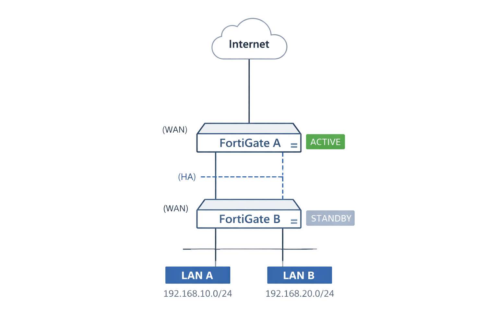

# Lab 04 – FortiGate High Availability (Active/Passive)

## 📌 Overview
This lab demonstrates how to design, configure, and validate a
**FortiGate High Availability (HA) Active/Passive cluster**.

The objective is to achieve **service continuity, redundancy, and
minimal downtime** in enterprise network environments.

---

## 🎯 Objectives
- Understand FortiGate HA concepts
- Configure Active/Passive HA cluster
- Synchronize configuration and sessions
- Test failover scenarios
- Apply HA best practices

---

## 🧱 Lab Environment

### 🔧 Devices
- FortiGate A (Primary)
- FortiGate B (Secondary)

### 🌐 Network Interfaces
- WAN
- LAN
- HA (Dedicated heartbeat interface)

### 🧩 Requirements
- Same FortiGate model & firmware version
- Identical interface layout
- Dedicated HA interfaces (recommended)

---

## 🌐 Topology

---

## 🧠 FortiGate HA Concepts

- **Active/Passive**: One unit processes traffic, the other waits
- **Heartbeat Interfaces**: Used for synchronization and health checks
- **Session Sync**: Preserves active sessions during failover
- **Override**: Controls master election behavior

---

## ⚙️ Step 1 – Pre-Configuration Checklist
Before enabling HA:
- Verify same model & firmware
- Factory reset both devices
- Confirm interface names and cabling
- Disable DHCP on both devices
- Backup configurations

📌 Never enable HA on a misaligned setup.

---

## ⚙️ Step 2 – HA Configuration (Primary Unit)

Navigate to:  
`System → HA`

### 🔧 HA Settings
- Mode: **Active-Passive**
- Device Priority: `200`
- Group Name: `ITGEEX-HA`
- Group ID: `10`
- Password: Strong HA password
- Heartbeat Interfaces: `port3` (or dedicated HA ports)
- Monitor Interfaces: `WAN`, `LAN`
- Session Pickup: **Enable**
- Override: **Disable** (recommended)

Apply and wait for reboot.

---

## ⚙️ Step 3 – HA Configuration (Secondary Unit)
Repeat same steps, with:
- Device Priority: `100`

📌 All HA parameters **must match** exactly.

---

## ⚙️ Step 4 – Cluster Verification

Check HA status:
- Dashboard → System Information
- Status should show:
  - Cluster: **Up**
  - Role: Primary / Secondary
  - Sync Status: In Sync

CLI verification:
get system ha status
diagnose sys ha status

---

## ⚙️ Step 5 – Management Access
- Access the cluster using **virtual IP**
- Optionally configure:
  - Reserved management interface
  - Individual unit management

📌 Document management IPs clearly.

---

## 🧪 Step 6 – Failover Testing

### 🔄 Test Scenarios
- Power off Primary unit
- Disconnect monitored interface (WAN)
- Reboot Primary device

Expected Results:
- Secondary becomes Active
- Minimal packet loss
- Sessions preserved (if supported)

---

## 🔍 Troubleshooting

| Issue | Possible Cause |
|------|---------------|
| Cluster not forming | Firmware mismatch |
| Frequent failover | Interface flapping |
| Config not synced | HA password mismatch |
| Session drop | Session pickup disabled |

Useful CLI commands:
diagnose sys ha checksum show
diagnose sys ha dump-by group

---

## 🔐 HA Best Practices
- Use dedicated HA interfaces
- Monitor critical interfaces only
- Disable override in production
- Keep firmware versions identical
- Schedule controlled failover tests
- Backup configuration regularly

---

## 📄 Outcome
At the end of this lab:
- FortiGate HA cluster is operational
- Configuration and sessions are synchronized
- Failover works as expected
- Environment is production-ready

---

## 📌 Next Lab
➡ **Lab 05 – Security Profiles (IPS / AV / Web Filter)**
